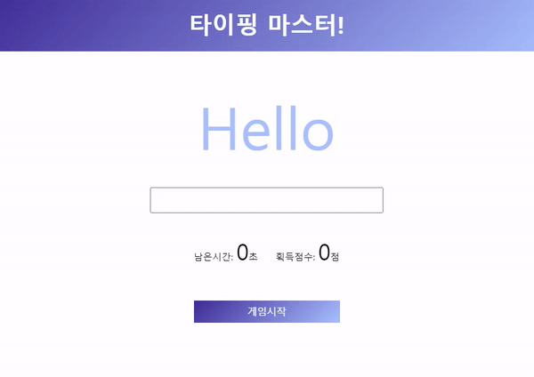

# typingGame


## 기능 
타자 게임   

## 학습 
### 1. JS : Axios 
: Axios는 브라우저, Node.js를 위한 Promise API를 활용하는 HTTP 비동기 통신 라이브러리       

: 쉽게 말해서 backend, frontend 통신을 쉽게 하기 위해 Ajax와 더불어 사용    

: 자바스크립트에는 fetch api 가 있지만, 프레임워크에서 ajax를 구현할때는 axios를 쓴다.    

- GET 요청
```
const axios = require('axios');

// ID로 사용자 요청
axios.get('/user?ID=12345')
  // 응답(성공)
  .then(function (response) {
    console.log(response);
  })
  // 응답(실패)
  .catch(function (error) {
    console.log(error);
  })
  // 응답(항상 실행)
  .then(function () {
    // ...
  });
```

### 2. JS : Toastify
가벼운 바닐라 JS 토스트 알림 라이브러리    
```
Toastify({
  text: "This is a toast",
  duration: 3000,
  destination: "https://github.com/apvarun/toastify-js",
  newWindow: true,
  close: true,
  gravity: "top", // `top` or `bottom`
  position: "left", // `left`, `center` or `right`
  stopOnFocus: true, // Prevents dismissing of toast on hover
  style: {
    background: "linear-gradient(to right, #00b09b, #96c93d)",
  },
  onClick: function(){} // Callback after click
}).showToast();
```

## 학습 출처
**<클래스 101>**     
바닐라 자바스크립트로 배우는 모던 프론트엔드 실전!

**API**    
https://random-word-api.herokuapp.com/home   

**JS**      
https://yamoo9.github.io/axios/guide/  
https://velog.io/@yrats/Axios         
https://github.com/apvarun/toastify-js/blob/master/README.md    

**키워드**      
Axios     
toastify-js    